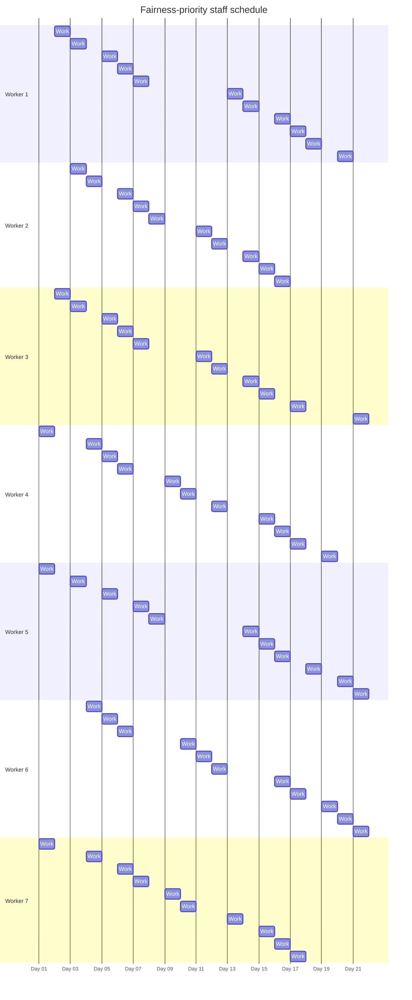
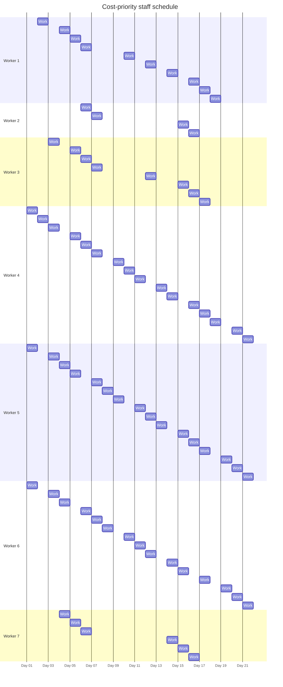

# Retail Store Staff Scheduling Optimization

A mixed-integer optimization project reconstructed from my MSc **Managerial Decision Making and Modelling** coursework at Ca' Foscari University of Venice.

The original submitted notebook is preserved in this repository. During a 2026 portfolio audit, I identified several formulation issues in the coursework model. I therefore added a separate **validated reconstruction** rather than silently presenting the original numerical outputs as correct.

---

## Key results

The corrected model can satisfy the complete **21-day staffing plan with zero temporary-worker days**.

The main result is a transparent **cost–fairness trade-off**:

- **Cost priority:** regular labor cost = **685**, workload range = **12 days**
- **Fairness priority:** regular labor cost = **725**, workload range = **1 day**
- A **5.8% increase in regular labor cost** reduces the workload imbalance from **12 days to only 1 day**


The lowest-cost solution concentrates assignments among cheaper workers. By contrast, the fairness-priority solution redistributes assignments almost evenly across the seven regular employees.


### Scenario comparison

| Scenario | Temporary-worker days | Regular labor cost | Workload range |
|---|---:|---:|---:|
| **Cost priority** | **0** | **685** | **12 days** |
| **Fairness priority** | **0** | **725** | **1 day** |

---

# Employee schedules

The optimization result is easier to understand visually than as a raw assignment matrix.

Each block below represents **one assigned workday** for an employee over the 21-day planning horizon.

## Fairness-priority roster



### Interpretation

The fairness-priority schedule produces an almost perfectly balanced roster:

- five workers receive **11 workdays**
- two workers receive **10 workdays**
- workload range = **1 day**
- temporary-worker use = **0**

The solution therefore achieves substantial workload equity while satisfying the staffing, rest and skill constraints.

---

## Cost-priority roster



### Interpretation

The cost-priority solution is considerably less balanced:

- Worker 2 works only **4 days**
- Workers 4 and 5 work **16 days**
- Worker 6 works **15 days**
- workload range = **12 days**

This concentration is not a modelling error. It follows directly from minimizing labor cost after satisfying the staffing constraints.

The fairness-priority solution therefore illustrates the operational cost of imposing a more equitable workload distribution.

---

## Workload comparison

| Worker | Cost priority | Fairness priority |
|---|---:|---:|
| Worker 1 | 10 | 11 |
| Worker 2 | 4 | 10 |
| Worker 3 | 8 | 11 |
| Worker 4 | 16 | 11 |
| Worker 5 | 16 | 11 |
| Worker 6 | 15 | 11 |
| Worker 7 | 6 | 10 |

The contrast is particularly visible for Workers 2, 4, 5 and 6. The fairness objective redistributes assignments while increasing regular labor cost by only **40 units**.

---

# Optimization problem

The goal is to schedule **seven regular workers across 21 days** while satisfying operational constraints.

Let $\mathcal W$ denote the set of regular workers and $\mathcal D=\{1,\ldots,21\}$ the planning days.

The model includes:

- daily staffing requirements
- worker availability
- heterogeneous worker skills
- day-specific skill requirements
- a rest constraint limiting each worker to at most **3 workdays in any consecutive 4-day window**
- optional temporary workers when the regular workforce cannot satisfy demand

The portfolio reconstruction evaluates two alternative objectives after first minimizing temporary-worker use:

1. **Cost-priority solution** — minimize total regular-worker labor cost.
2. **Fairness-priority solution** — minimize the difference between the largest and smallest individual workloads, then minimize labor cost among schedules with the same optimal fairness level.

---

# Mathematical formulation

## Decision variables

For every worker $w\in\mathcal W$ and day $d\in\mathcal D$, define

$$
x_{wd}
=
\begin{cases}
1, & \text{if worker } w \text{ is assigned on day } d,\\
0, & \text{otherwise}.
\end{cases}
$$

Temporary-worker use is represented by

$$
e_d\in\mathbb Z_{+},
\qquad d\in\mathcal D,
$$

where $e_d$ is the number of temporary workers used on day $d$.

Parameters are:

- $r_d$: required number of workers on day $d$;
- $c_w$: labor cost of regular worker $w$;
- $s_w$: skill level of regular worker $w$;
- $q_d$: minimum skill level required on day $d$.

## Daily staffing requirement

For every day $d\in\mathcal D$,

$$
\sum_{w\in\mathcal W}x_{wd}+e_d=r_d.
$$

This ensures exact daily staffing coverage.

## Availability constraint

If worker $w$ is unavailable on day $d$, then

$$
x_{wd}=0.
$$

Availability is therefore imposed directly on the assignment variables.

## Consecutive-workday constraint

For every worker $w\in\mathcal W$ and every four-day window beginning at $d=1,\ldots,18$,

$$
\sum_{j=d}^{d+3}x_{wj}\le 3.
$$

Thus no worker may be assigned on all four days of any consecutive four-day period.

## Skill requirement

Let

$$
\mathcal W_d^{\mathrm{qual}}
=
\{w\in\mathcal W:s_w\ge q_d\}
$$

be the workers whose skill level meets the threshold for day $d$. Then

$$
\sum_{w\in\mathcal W_d^{\mathrm{qual}}}x_{wd}\ge 1,
\qquad d\in\mathcal D.
$$

This guarantees that at least one sufficiently skilled regular worker is assigned each day.

---

# Cost objective

Conditional on the minimum feasible temporary-worker use, the cost-priority problem is

$$
\min_{x,e}
\quad
\sum_{w\in\mathcal W}\sum_{d\in\mathcal D}c_wx_{wd}.
$$

The resulting regular labor cost is

$$
\boxed{685},
$$

with zero temporary-worker days.

---

# Fairness objective

Define the workload of worker $w$ as

$$
L_w=\sum_{d\in\mathcal D}x_{wd}.
$$

Let

$$
L^{\max}=\max_{w\in\mathcal W}L_w,
\qquad
L^{\min}=\min_{w\in\mathcal W}L_w.
$$

The fairness objective is

$$
\min_{x,e}
\quad
L^{\max}-L^{\min}.
$$

The optimal fairness-priority solution satisfies

$$
L^{\max}-L^{\min}=1.
$$

Conditional on that optimal fairness level, labor cost is minimized. The resulting regular labor cost is

$$
\boxed{725}.
$$

---

# Lexicographic optimization

The optimization is performed sequentially rather than by assigning arbitrary weights to competing objectives.

### Stage 1 — minimize temporary-worker use

$$
E^*
=
\min_{x,e}
\sum_{d\in\mathcal D}e_d.
$$

The optimum is

$$
E^*=0.
$$

### Stage 2A — cost-priority solution

Conditional on $\sum_de_d=E^*$,

$$
C^*
=
\min_x
\sum_{w\in\mathcal W}\sum_{d\in\mathcal D}c_wx_{wd}.
$$

### Stage 2B — fairness-priority solution

Conditional on $\sum_de_d=E^*$,

$$
F^*
=
\min_x
\left(L^{\max}-L^{\min}\right).
$$

Among schedules satisfying $L^{\max}-L^{\min}=F^*$, the model then minimizes regular labor cost.

This lexicographic structure makes the optimization priorities explicit and avoids an arbitrary weighted-sum objective.

---

# What was corrected from the coursework model

The original coursework notebook is preserved for provenance, but the portfolio reconstruction corrects several modelling problems discovered during review.

## 1. Availability

The original model constructed worker-day combinations but did not operationally enforce worker availability.

The reconstruction explicitly fixes unavailable assignments to zero.

## 2. Skill matching

The original formulation aggregated employee skill scores.

That can incorrectly satisfy a skill requirement even if **no individual assigned worker is sufficiently qualified**.

The reconstruction instead requires

$$
\sum_{w\in\mathcal W_d^{\mathrm{qual}}}x_{wd}\ge1.
$$

## 3. Fairness objective

The original coursework fairness expression algebraically reduced to total assignments minus a constant.

It therefore did not actually measure inequality between workers.

The reconstruction explicitly minimizes

$$
L^{\max}-L^{\min}.
$$

---

# Main takeaway

The project illustrates an important operations-research trade-off:

> **The cheapest feasible schedule is not necessarily the most equitable schedule.**

Both solutions satisfy the same staffing requirements and use **zero temporary workers**.

However:

- minimizing cost yields **685** units of labor cost and a **12-day workload range**
- prioritizing fairness yields **725** units of labor cost and only a **1-day workload range**

Thus, an additional **40 cost units — approximately 5.8% — produces a dramatic improvement in workload equity**.

---

# Repository structure

```text
staff_scheduling_optimization_pyomo/
│
├── README.md
├── Data.json
├── Retail Store Staff Scheduling.ipynb
│
├── coursework/
│   └── original_github_Data.json
│
├── docs/
│   └── model_audit.md
│
├── figures/
│   ├── objective_tradeoff.svg
│   └── workload_comparison.svg
│
├── src/
│   └── solve_staff_schedule.py
│
├── results/
│   ├── scenario_summary.csv
│   ├── cost_schedule.csv
│   ├── fairness_schedule.csv
│   └── workload_comparison.csv
│
└── requirements.txt
```

---

# Reproduce the validated analysis

Create a virtual environment:

```bash
python -m venv .venv
```

Activate it and install the dependencies:

```bash
pip install -r requirements.txt
```

Run the cost-priority model:

```bash
python src/solve_staff_schedule.py --scenario cost
```

Run the fairness-priority model:

```bash
python src/solve_staff_schedule.py --scenario fairness
```

The validated reconstruction uses **SciPy's MILP interface with the HiGHS solver**.

The original coursework notebook uses **Pyomo** and remains in the repository as the original coursework artifact.

---

# Interpretation boundary

This is an illustrative operations-research project based on coursework data.

The staffing requirements, worker salaries and skill values are modelling inputs rather than claims about an actual firm's workforce.

The optimized schedules demonstrate:

- mixed-integer optimization
- constraint formulation
- staffing and scheduling
- multi-objective decision making
- cost–equity trade-offs
- model auditing
- reproducible analytical workflows

They should not be interpreted as empirical findings about a real organization.

---

## Author

**Maha Gasim**  
MSc Data Analytics for Business and Society  
Ca' Foscari University of Venice