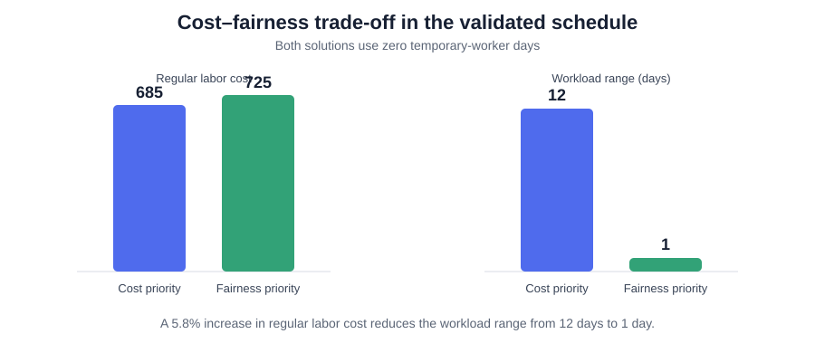
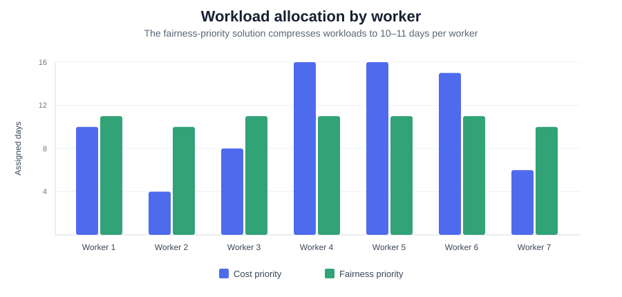

# Retail Store Staff Scheduling Optimization

A mixed-integer optimization project reconstructed from my MSc **Managerial Decision Making and Modelling** coursework at Ca' Foscari University of Venice.

The original submitted notebook is preserved in this repository. During a 2026 portfolio audit I found several formulation issues in the coursework model, so I added a separate **validated reconstruction** rather than silently presenting the original numerical outputs as correct.

## Key results

The corrected model can satisfy the full 21-day staffing plan with **zero temporary-worker days**. The main result is a transparent cost–equity trade-off:

- **Cost priority:** labor cost = **685**, workload range = **12 days**.
- **Fairness priority:** labor cost = **725**, workload range = **1 day**.
- A **5.8% increase in regular labor cost** reduces the workload range from 12 days to 1 day.



The low-cost solution concentrates assignments on cheaper workers, while the fairness objective redistributes work almost evenly across the seven regular employees.



| Scenario | Temporary-worker days | Regular labor cost | Workload range |
|---|---:|---:|---:|
| Cost priority | **0** | **685** | **12 days** |
| Fairness priority | **0** | **725** | **1 day** |

### Workload allocation

| Worker | Cost priority | Fairness priority |
|---|---:|---:|
| worker_1 | 10 | 11 |
| worker_2 | 4 | 10 |
| worker_3 | 8 | 11 |
| worker_4 | 16 | 11 |
| worker_5 | 16 | 11 |
| worker_6 | 15 | 11 |
| worker_7 | 6 | 10 |

## Problem

Schedule seven regular workers over a 21-day planning horizon subject to:

- daily staffing requirements;
- worker availability;
- heterogeneous skill requirements;
- a rest rule limiting each worker to at most 3 workdays in any consecutive 4-day window;
- optional temporary workers if regular staffing cannot meet demand.

The portfolio version studies two competing objectives after first minimizing temporary-worker use:

1. **Cost priority:** minimize regular labor cost.
2. **Fairness priority:** minimize the range between the most- and least-worked regular employees, then minimize labor cost among equally fair schedules.

## Mathematical formulation

Let

- \(x_{wd}\in\{0,1\}\) equal 1 when regular worker \(w\) is assigned on day \(d\);
- \(e_d\in\mathbb Z_+\) be the number of temporary workers used on day \(d\);
- \(r_d\) be required staff on day \(d\);
- \(c_w\) be the regular-worker cost;
- \(q_d\) be the minimum skill level required on day \(d\).

Daily coverage is

\[
\sum_w x_{wd}+e_d=r_d \qquad \forall d.
\]

For each worker and each four-day window,

\[
\sum_{j=d}^{d+3}x_{wj}\le 3.
\]

Availability is imposed directly by fixing \(x_{wd}=0\) when worker \(w\) is unavailable on day \(d\).

The skill rule requires at least one assigned regular worker whose skill meets the day's threshold:

\[
\sum_{w:s_w\ge q_d}x_{wd}\ge 1 \qquad \forall d.
\]

For fairness, define individual workload \(L_w=\sum_d x_{wd}\), maximum workload \(L^{max}\), and minimum workload \(L^{min}\). The fairness objective minimizes

\[
L^{max}-L^{min}.
\]

The model uses **lexicographic optimization**: temporary-worker use is minimized first, and the scenario-specific objective is optimized conditional on that minimum.

## What was corrected from the coursework notebook

The audit identified three important modelling issues:

1. **Availability was not operationally enforced.** The original model constructed worker-day combinations but did not constrain assignments using the availability field.
2. **Skill matching was aggregated incorrectly.** Summing assigned workers' skill values can satisfy a threshold without ensuring that any single assigned worker actually possesses the required skill level.
3. **The original “fairness” objective was not a fairness measure.** Algebraically, it reduced to total assignments minus a constant, so it could not equalize workloads.

The original notebook is retained as coursework provenance; the numerical results highlighted above come only from the corrected model in [`src/solve_staff_schedule.py`](src/solve_staff_schedule.py).

## Repository structure

```text
staff_scheduling_optimization_pyomo/
├── README.md
├── Data.json
├── Retail Store Staff Scheduling.ipynb   # original coursework notebook
├── coursework/
│   └── original_github_Data.json         # archived pre-audit repo input
├── docs/
│   └── model_audit.md
├── figures/
│   ├── objective_tradeoff.svg
│   └── workload_comparison.svg
├── src/
│   └── solve_staff_schedule.py
├── results/
│   ├── scenario_summary.csv
│   ├── cost_schedule.csv
│   ├── fairness_schedule.csv
│   └── workload_comparison.csv
└── requirements.txt
```

## Reproduce the validated model

```bash
python -m venv .venv
# activate the environment
pip install -r requirements.txt

python src/solve_staff_schedule.py --scenario cost
python src/solve_staff_schedule.py --scenario fairness
```

The reconstruction uses SciPy's MILP interface with the HiGHS solver. The original notebook uses Pyomo and remains available for provenance.

## Interpretation boundary

This is an illustrative operations-research problem based on coursework data. The salary values, staffing requirements and skills are modelling inputs, not claims about an actual firm's workforce. The optimized schedules demonstrate formulation, constraint design and multi-objective trade-offs rather than an empirical causal analysis.

## Author

**Maha Gasim**  
MSc Data Analytics for Business and Society, Ca' Foscari University of Venice
